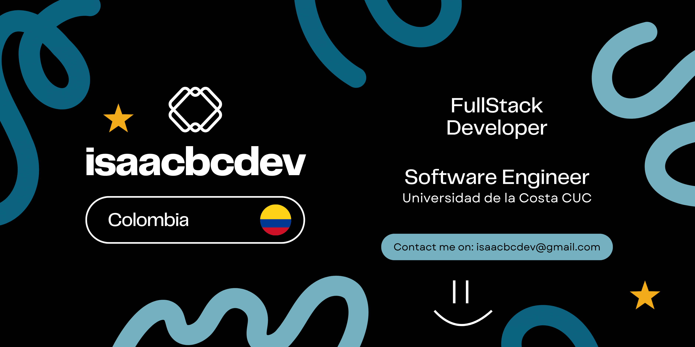

<h1>Hi 👋, I'm Isaac, a Fullstack Developer from Colombia</h1>

I'm a Systems Engineering student at Universidad de la Costa, passionate about creating robust and scalable applications. My primary focus is backend development with <strong>Java + Spring Boot</strong>, but I enjoy building dynamic user interfaces using <strong>Thymeleaf, Bootstrap, Angular and React</strong>. I’ve worked on both personal and team-based projects, integrating APIs, managing SQL and NoSQL databases, and deploying apps on platforms like <strong>Firebase, Netlify, and Heroku</strong>.

Currently exploring better developer experiences with tools like <strong>Notion</strong> for planning, <strong>Figma/Canva</strong> for UI drafts, and continuously testing with <strong>Postman</strong>. I'm always open to new challenges and collaboration in web app development, community tools, or productivity platforms.

<h2>🚀 Languages and Tools I Use</h2>

<h3>Programming Languages</h3>

<h3>Frontend Frameworks & Libraries</h3>

<h3>Backend Frameworks</h3>

<h3>Databases</h3>

<h3>Deployement & DevOps </h3>

<h3>Version Control</h3>

<h3>API Testing</h3>

### 🌐 Connect with me

<picture>
  <source media="(prefers-color-scheme: dark)" srcset="https://raw.githubusercontent.com/tobiasmeyhoefer/tobiasmeyhoefer/output/github-snake-dark.svg" />
  <source media="(prefers-color-scheme: light)" srcset="https://raw.githubusercontent.com/tobiasmeyhoefer/tobiasmeyhoefer/output/github-snake.svg" />
  
</picture>
